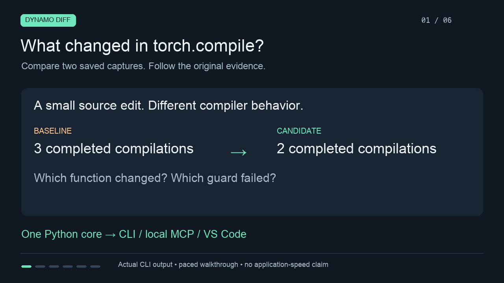

# Dynamo Diff walkthrough

[Watch or download the 72-second video](https://github.com/Arnavsharma2/dynamo-diff/releases/download/v0.1.0/walkthrough.mp4) · [Transcript](demo/TRANSCRIPT.md) · [Command receipt](demo/receipt.json)

[](demo/walkthrough.mp4)

The video presents selected fields from seven actual CLI subprocess calls against the retained authored-edit captures: two imports, comparison, both source snapshots, baseline analysis and original evidence retrieval. All seven commands succeeded. The receipt preserves argument lists, complete stdout, stderr, exit codes, timings and hashes. Source excerpts omit only an explanatory comment; the displayed evidence hash is shortened, with the full value in the receipt.

The timeline is paced for reading and has no audio. It is a visual presentation of captured CLI output, not a native VS Code screen recording or processing benchmark. All six chapter images were visually inspected; the encoded H.264 video was decoded successfully at 1280×720, 12 fps and 72 seconds.

## What the example shows

The comparison matches `compute` across an ordinary source edit and changed frame IDs. Three completed compilations, including two confirmed recompilations, become one completed compilation with no confirmed recompilation. The candidate's new helper remains unmatched and adds another completed compilation to candidate totals, making the overall comparison three → two.

Original baseline evidence retains `step == 1`, its captured `if step > 0` context, artifact `-_0_1_0/recompile_reasons_4.json`, record 10 and SHA-256 `832c22b265eea6007916338024fa9ad308f931e2ca6ecf4bbc57ce205b43dc6a`. Manifest consistency describes matching declarations; it does not prove equivalent execution. Application speed remains unmeasured.

## Reproduce the commands

From the source checkout, with Dynamo Diff installed:

```sh
python tools/demo.py
python tools/record_demo.py --output artifacts/demo/my-new-recording
```

The second command records a terminal-oriented five-command walkthrough. It refuses to overwrite an existing directory and uses a temporary capture store. `--pause 0` removes presentation pauses. The earlier [26-second asciicast recording](../artifacts/demo/cli-003/walkthrough.cast), [plain-text transcript](../artifacts/demo/cli-003/transcript.txt) and [receipt](../artifacts/demo/cli-003/receipt.json) remain available.

## Rebuild the visual presentation

`tools/create_release_demo.py` uses optional authoring tools: Pillow 12.3, an ffmpeg executable with H.264 encoding, and local proportional/monospace TrueType fonts. These are not analyzer dependencies. With Pillow available in the authoring interpreter:

```sh
python tools/create_release_demo.py --python /absolute/path/to/dynamo-diff-env/bin/python --ffmpeg /absolute/path/to/ffmpeg --font /absolute/path/to/proportional.ttf --mono-font /absolute/path/to/monospace.ttf --output artifacts/demo/my-new-visual-demo
```

The command interpreter must have Dynamo Diff installed; keep its virtual-environment path intact. The output directory must be new. The script executes the seven CLI calls, checks the selected observations and renders six chapter images, a GIF, MP4, transcript and receipt. Font and encoder differences may change media hashes. Inspect the output before sharing it.

## VS Code verification

The native walkthrough is complete in the approved demo profile: imports, comparison table, baseline source, candidate source and original guard evidence were visually inspected in one editor group. Candidate `model.py` opens `compute` at captured line 9, with `VARIANT = "after"`, the branch-free `return x.sin() * 2` and the new helper. Baseline and candidate snapshots remain distinct and read-only.

The installed-VSIX integration suite passed eleven checks, including source/evidence navigation, error recovery, cancellation, active-editor-group reuse and the rendered table. [Verification evidence](../artifacts/VERIFICATION.md) retains the earlier editor-column regression and native UI recovery chronology. The public video demonstrates CLI evidence; it does not replace those separately recorded editor checks.
