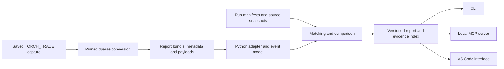

# Dynamo Diff — project scope

**Working name; scoped September 6, 2026. Status: researched proposal, not implemented or user-validated.**

## 1. Decision and evidence

Build a local tool that compares PyTorch Dynamo compilation behavior between two recorded runs and returns source-linked evidence to an engineer or coding agent. Ship the analysis engine and CLI first, an MCP interface second, and a small VS Code interface once the analysis is useful.

The pain is real and ongoing. A **July 10, 2026 TorchTitan report** describes an RL generation workflow hitting Dynamo's recompilation limit and failing. Its logs contain changing tensor dimensions, dispatch-key differences, and tensor-type changes. This is a concrete recent example of the distinction the tool should explain. The reported environment used development builds; we have not reproduced it or established that the same failure affects today's stable releases. [TorchTitan #3898](https://github.com/pytorch/torchtitan/issues/3898)

A separate **June 4, 2026 Transformers report**, now closed, describes extra compilation around chunked prefill and cache initialization. It is a possible before/after case study, not evidence of an unresolved bug. Its associated experiment uses one observation per scenario, so its timings are not a benchmark to repeat as a general speedup. [Transformers #46421](https://github.com/huggingface/transformers/issues/46421), [reproduction notes](https://github.com/dacorvo/transformers-generation-compile/blob/main/README.md)

The interpretation problem is also documented directly: an **October 31, 2025 tlparse issue** explains why several rejected cached specializations can appear in the reasons associated with one new compilation. Counting those reasons as separate recompilations would be wrong. This is older evidence for the diagnostic need. [tlparse #153](https://github.com/meta-pytorch/tlparse/issues/153)

**Established:** developers still encounter consequential compilation behavior that requires careful interpretation. **Hypothesis to test:** a conservative, agent-consumable before/after report saves useful diagnostic work compared with existing tools. These sources do not establish market size, willingness to pay, or that nobody has built something similar.

### Existing tools and the proposed contribution

| Tool | Existing capability | Our intended contribution |
|---|---|---|
| tlparse | Compiler trace inspection, artifacts, and plain-text output intended to facilitate diffing; current CLI takes one input path. | A narrow comparison model for Dynamo events, guard evidence, and workload comparability. Reuse its trace processing. |
| TritonParse | Kernel and whole-trace comparison, matching, JSON output, and AI-assisted analysis. | Stay at Dynamo's Python/guard specialization layer; defer kernel and compiler IR comparison. |
| TorchLens | Model inspection and agent/MCP interfaces; its agent documentation excludes tracing `torch.compile` artifacts. | Inspect saved compiler artifacts rather than executing and tracing an ordinary model. |

This is a proposed specialization, not a claim to invent trace diffing or MCP. Recheck these tools during the first milestone. [tlparse CLI](https://github.com/meta-pytorch/tlparse/blob/main/src/cli.rs), [TritonParse releases](https://github.com/meta-pytorch/tritonparse/releases), [TorchLens agent documentation](https://github.com/johnmarktaylor91/torchlens/blob/main/docs/for-ai-agents.md)

## 2. User, problem, and product promise

**Primary user:** an ML engineer who already uses `torch.compile`, edits model or input-handling code, and needs to understand a compilation change. Start with single-process workloads or one explicitly selected process/rank from a larger capture.

**Secondary user:** a coding agent helping that engineer. The agent calls a deterministic tool to obtain measured compiler evidence, then uses that evidence in its own reasoning.

The question we answer is:

> Between these two captures, which source functions compiled differently, which guard failures were recorded, and what evidence should I inspect next?

The answer should distinguish initial/additional compilation, confirmed recompilation, failed attempts, graph breaks, and missing evidence. It should also disclose whether the two workloads are comparable.

The product does not promise that recompilation was avoidable, that a particular line caused it, that model outputs remain correct, or that fewer compilations make execution faster. Those require additional evidence.

### Illustrative user flow

1. An engineer captures baseline and candidate runs with the same declared input sequence and compiler settings.
2. They import the two tlparse report bundles and associated run manifests.
3. The tool aligns identifiable source functions, compares observed events, and groups recorded guard reasons.
4. A report says, for example: “This function has two more confirmed successful recompilations. Recorded failures involve a Python scalar and a tensor dimension. Both reasons have linked evidence.” These numbers are an illustration, not a measured result.
5. The engineer opens the baseline or candidate evidence and decides what to change.
6. They run a new capture. The comparison shows whether the compiler behavior changed; separate correctness and timing checks establish whether the change helped the application.

## 3. Release boundaries

### MVP: independently useful command-line analyzer

- Import saved reports generated by one pinned tlparse build for one tested PyTorch version.
- Analyze one process/rank and ordinary Dynamo traces; identify unsupported compiled-autograd or distributed captures explicitly.
- Reconstruct compilation identities, attempts, outcomes, and available recompile evidence.
- Preserve graph breaks, failures, compiler-limit events, and unknowns separately.
- Compare functions that can be matched conservatively across two source snapshots.
- Classify supported guard text into shape/stride, dtype/device, Python scalar, grad/mode, type/identity/dispatch, and unknown categories. Categories may overlap; retain the original text.
- Export versioned JSON and a readable terminal/Markdown report, with reproducible evidence references.
- Report manifest differences and missing fields before interpreting deltas.
- Include controlled fixtures, expected answers, documentation, and a reproducible demo.

### Portfolio v1: MVP plus integrations and evaluation

- Local MCP server with three small tools backed by the same core.
- VS Code commands to import, compare, and open source/evidence.
- A baseline/candidate table with counts, reason categories, match status, and limitations.
- One independently reproducible real-project diagnosis; aim for a second if feasible.
- A held-out pilot comparing agent diagnosis with raw logs, tlparse text, and this tool.
- Installable Python package, extension VSIX, CI, architecture notes, and release instructions.

### Explicitly deferred

Automated model edits; autonomous training launches; universal OOM/performance diagnosis; GPU profiling; CUDA graph analysis; Triton/Inductor IR or kernel diffing; multi-rank aggregation; arbitrary-version support; continuous background capture; cloud accounts; payments; model training; an embedded chatbot; learned matching; and a claim that the tool proves a fix.

An upstream tlparse contribution is an acceptable outcome if it serves users better than a separate product. The analysis work and evaluation remain valuable portfolio evidence.

## 4. Architecture and technology choices



**Python core:** a small typed package with schema validation, streaming metadata reading, explicit adapter versions, deterministic comparison, and lazy evidence loading. It should not require PyTorch or a GPU merely to inspect an existing report. Keep PyTorch in fixture-generation dependencies.

**Conversion:** initially consume tlparse's machine-readable output and linked payloads. Do not scrape its HTML or build an entire replacement parser. Raw structured traces have prefixed records and multiline payloads, rather than being ordinary JSONL. The inspected upstream source has a `raw.jsonl` export containing string-table information and references to separate payload files. Verify this contract in the first spike. [tlparse source](https://github.com/meta-pytorch/tlparse/tree/98b8782b90f076f3d77a4a414316e3c8d0d127d4/src)

The inspected tlparse revision is `98b8782b90f076f3d77a4a414316e3c8d0d127d4` (Cargo version 0.4.9). Treat it as a research reference, not a tested dependency claim. Milestone 1 must choose and lock a usable release or commit, a PyTorch version, and a Python version, then record successful fixture generation and conversion. Do not advertise compatibility before that.

**Storage:** local immutable imported bundles, normalized JSON, and an evidence index. Identify content by hashes; cache keys include input hashes, adapter version, schema version, and comparison options. A database is unnecessary initially.

**MCP:** a Python adapter using the supported SDK version selected during implementation. It reads approved local report roots and returns bounded data. No model API is required by the analyzer.

**VS Code:** TypeScript commands and native views first. Use a configured Python executable to invoke the CLI with structured arguments, not shell interpolation. Cancellation and errors must reach the UI. A custom webview is optional after native views prove insufficient.

Suggested layout:

```text
src/dynamo_diff/
  adapters/       # Pinned upstream formats
  model/          # Events, manifests, report schema
  compare/        # Source matching, categories, deltas
  evidence/       # Immutable references and bounded retrieval
  cli.py
  mcp_server.py
extension/        # Thin TypeScript client
fixtures/         # Small authored workloads and expected records
benchmarks/       # Import performance and diagnostic evaluation
docs/             # Semantics, compatibility, case studies
```

## 5. Correctness contract: the difficult engineering

### Events are not warning lines

Use a run-local identity that namespaces process/rank, frame ID, frame compile ID, and any supported enclosing context. Store internal attempt IDs beneath a compilation identity.

| Record/concept | Rule |
|---|---|
| Internal tracing attempt | Multiple attempts do not automatically mean multiple recompilations. |
| Completed compilation | Require the supported format's success evidence. An emitted graph alone is insufficient. |
| Failed or incomplete compilation | Preserve separately; do not count as successfully compiled. |
| Skipped/no compiled graph | Successful frame processing or an absent error field does not establish that a compiled graph was installed. Preserve skip evidence or leave the outcome unresolved. |
| Confirmed recompilation | Require explicit version-specific recompile evidence associated with that compilation. Record its outcome separately. |
| Additional frame compilation | Use this description when a later compilation lacks enough evidence to classify as a recompile. |
| Rejected cached specialization | Several guard failures may belong to one new compilation. Rejection alone does not establish a new compile event. |
| Graph break | Separate emitted break records, unique sites, and resumed regions. |
| Compiler limit/fallback | Preserve explicitly; fewer later compile events do not establish improvement. |

In particular, `frame_compile_id > 0` is not a sufficient recompilation test: PyTorch's cache logic distinguishes separate identity-matched module instances from recompilation within an identity group. Use upstream semantics and trace tests as references. [cache-size semantics](https://github.com/pytorch/pytorch/blob/main/torch/_dynamo/cache_size.py), [compilation recording](https://github.com/pytorch/pytorch/blob/main/torch/_dynamo/convert_frame.py), [structured-trace tests](https://github.com/pytorch/pytorch/blob/main/test/dynamo/test_structured_trace.py)

Do not fabricate missing guard information. Normalize supported reason payloads, including a string versus a list of strings, without discarding the original evidence. Never evaluate guard expressions as Python. [guard implementation](https://github.com/pytorch/pytorch/blob/main/torch/_dynamo/guards.py)

### Cross-run source matching

Run-local frame numbers are not stable comparison keys. Build source identities from available file/function information, captured source, stack context, and generated-resume relationships.

Prefer unique exact matches. Use supplied Git diff/source mappings for line shifts, and allow an explicit user mapping when needed. A renamed, split, merged, generated, or ambiguously duplicated function must remain unresolved if the evidence is insufficient. A source mapping establishes correspondence, not semantic equivalence.

Ordinary edits within a uniquely identifiable function must work without requiring the user to map every function manually. Combine file/function context with a verified source-diff mapping even when the function-body hash changes. Test that central use case before adding fuzzy matching.

Every match is `matched`, `ambiguous`, or `unmatched`, with a method and supporting fields. Do not hide unmatched functions from totals. Preserve both source snapshots so a baseline link cannot silently point at changed candidate code. First-line function attribution is acceptable; claim an exact triggering expression only if the trace supplies it.

### Comparison validity

Keep four distinct report areas: capture validity, workload comparability, compiler-event differences, and optional external performance measurements.

Distinguish valid artifact structure from a completed workload capture. A file can end cleanly between valid records while omitting later workload calls. Require explicit capture-finalization/run-completion evidence for a completeness claim; otherwise report workload completion as unknown, even if all observed compilations finished.

The run manifest should contain toolchain versions, source revision/dirty patch hash, backend and options, device, relevant environment settings, ordered input/workload specification, seed, warmup/measurement boundaries, and cache policy. Workload details should cover relevant shapes, strides, dtypes, grad/eval mode, and scalar arguments.

Ship a short manifest template and capture recipe. Missing fields should reduce the claims available, rather than prevent users from inspecting existing reports. The analyzer does not launch the workload to fill them in.

Use `manifest_consistent`, `confounded`, or `unknown`. Consistent declarations are not proof of an identical runtime workload. Missing manifests still allow descriptive comparison, but the report must say that workload equivalence is unknown. A change in workload/backend/version is displayed rather than silently attributed to a code edit.

A fresh process does not guarantee a cold persistent compiler cache. Record cache directories/policy separately; `torch._dynamo.reset()` is not a universal cold-cache reset. Diagnostic trace runs and application timing runs should be separate. Deliberate graph breaks can trade recompilation cost against runtime overhead. [PyTorch recompilation guidance](https://docs.pytorch.org/docs/stable/user_guide/torch_compiler/compile/programming_model.recompilation.html)

## 6. Interfaces and example output

Proposed commands; these do not exist yet:

```text
dynamo-diff import ./baseline-report --manifest baseline.json
dynamo-diff import ./candidate-report --manifest candidate.json
dynamo-diff compare <baseline-id> <candidate-id> --format json
dynamo-diff evidence <report-id> <evidence-id>
dynamo-diff serve-mcp
```

MCP tools:

| Tool | Input | Output |
|---|---|---|
| `import_trace` | Report directory within configured roots; optional manifest | Capture ID, adapter, completeness, unsupported/missing fields |
| `compare_runs` | Two capture IDs; optional source mapping and page size | Comparison status, changed functions, event deltas, evidence IDs |
| `get_evidence` | Report/evidence ID and requested bounded range | Raw excerpt, source attribution, artifact hash and record location |

Default reports should be compact and paginated; target a roughly 12,000-character initial response, with truncation explicitly disclosed. Evidence details are retrieved on demand. Errors distinguish unsupported format, malformed input, missing payload, inconsistent metadata, and resource limits.

Design example only:

```json
{
  "schema_version": "1",
  "capture_validity": {
    "artifact_structure": "valid",
    "workload_completion": "unknown"
  },
  "workload_comparability": "manifest_consistent",
  "functions": [{
    "source": "model.py:Decoder.forward",
    "match_status": "matched",
    "match_method": "explicit_source_mapping",
    "confirmed_successful_recompilations": {"baseline": 1, "candidate": 3},
    "unclassified_compilations": {"baseline": 0, "candidate": 0},
    "recorded_guard_categories": ["python_scalar", "tensor_shape"],
    "evidence_ids": ["candidate:event-7:reason-0", "candidate:event-9:reason-0"]
  }],
  "performance_conclusion": "not_measured"
}
```

“AI uses it behind the scenes” means an installed and enabled agent integration invokes these tools during debugging. There is no hidden monitoring requirement. VS Code documents both extension-host language-model tools and external MCP tools; MCP provides the reusable analysis interface, while the extension supplies editor navigation. [VS Code AI extensibility](https://code.visualstudio.com/api/extension-guides/ai/ai-extensibility-overview)

## 7. Trace handling and operational limits

Compiler traces can contain source code and local paths. Keep processing local by default, with no telemetry or automatic uploads. An agent may transmit returned excerpts to its configured model provider; local MCP does not make that inference local. Return source only when requested, and clearly label raw trace prose as untrusted data.

Resolve payload references inside the imported report root; reject path traversal, including symlinks escaping it. Import never executes embedded source, guards, or commands. Hash and preserve artifacts so evidence references survive report regeneration. Path redaction is optional export formatting, not a guarantee that all secrets are removed.

Set explicit input, record-size, payload, and response bounds. Read metadata incrementally and load payloads on demand. Benchmark representative 10 MiB and 100 MiB bundles, recording import time, peak memory, repeated comparison latency, and output size. Set regression thresholds after the first baseline measurement rather than inventing a speed claim. Document upstream tlparse conversion costs separately.

## 8. Test and evaluation plan

### Required controlled cases

Create small authored workloads under the pinned toolchain, with retained traces, manifests, expected normalized events, and human-reviewed explanations:

1. Stable repeated inputs: initial work followed by reuse.
2. Static shape sequence A → B → A: a new specialization followed by reuse.
3. Dynamic-shape generalization.
4. Python scalar specialization.
5. Grad/mode or type/identity changes distinct from tensor shapes.
6. Several recorded guard failures associated with one recompilation.
7. Graph break and resumed compilation regions.
8. Internal tracing restart within one compilation identity.
9. Backend failure after a graph was emitted, plus a skipped frame with no installed compiled graph.
10. Compiler limit/fallback that must not receive an improvement verdict.
11. Multiple module instances sharing a code object.
12. Source line shifts, changing frame IDs, ambiguous matches, and an ordinary behavior-preserving function-body edit that changes its source hash but still matches automatically.
13. Truncated captures, including clean truncation between valid records, missing payloads, malformed records, and unsupported versions.

Add robustness cases for duplicated imports, repeated IDs in distinct processes, spaces in paths, escaped-root payload paths, and unsupported compiled-autograd/multi-rank data. Preserve upstream license notices if reusing fixtures; prefer small self-authored cases over redistributing large public logs.

For simple one-graph examples, an instrumented backend can provide an independent check. Backend invocations are not a universal proxy for Dynamo compilation count. Golden records must be justified from upstream semantics and reviewed evidence, not generated and accepted by the parser being tested.

### Release gates

- Every essential fixture's expected event counts, outcomes, and reason associations match.
- Every explanation has evidence; unknown information stays unknown.
- Failed, incomplete, incomparable, or fallback cases never receive a “fixed” or “faster” verdict.
- Ambiguous matching cannot silently become a confident match.
- CLI, MCP, and editor consume the same report model and agree.
- A fresh environment can install the package and reproduce the documented demo.

### Small agent study

Prepare 8–12 held-out questions covering diagnosis, before/after comparison, multiple reasons per event, mismatched workloads, and false fixes. Use a fixed model/version, equivalent instructions, tool access, and budget across three conditions: raw logs, tlparse plain text, and Dynamo Diff. Repeat each a small number of times with randomized order.

Score against hand-reviewed answers: correct interpretation, unsupported claims, evidence accuracy, input/output tokens, tool calls, and elapsed time. Publish individual results and failures. Avoid revealing answers through filenames or tool descriptions. Treat this as a pilot; if no improvement appears, report that and revise the product. The core release must remain usable without paid model evaluation.

Any application-speed claim needs separate output-correctness checks and repeated measurements on the relevant hardware, with accelerator synchronization, documented cold/warm conditions, and baseline/candidate order variation. Report variability and inconclusive results. Do not add overlapping compiler phase durations as though they were independent wall-clock costs.

## 9. Delivery plan and time budget

**Planning estimate: 6–8 weeks at about 12–18 hours/week, roughly 90–140 focused hours.** This assumes comfortable Python/TypeScript development; learning compiler internals may take longer. A useful CLI should precede a polished extension. Time ranges are estimates, not measured work.

The stages below total 90–130 hours; allow up to 10 additional hours of contingency. Real-project reproduction is the largest scheduling uncertainty.

| Milestone | Budget | Deliverable and exit criterion |
|---|---:|---|
| 1. Feasibility and differentiation | 10–15 h | Pin versions; capture four small cases; recover identities, outcomes, and guard payloads; demonstrate a comparison existing text diff handles poorly. |
| 2. Parser and evidence model | 20–25 h | Typed normalization, immutable evidence references, failure/unknown handling, essential event fixtures. |
| 3. Comparison and CLI | 20–25 h | Conservative source matching, manifest gates, guard categories, JSON and readable output. CLI MVP ready. |
| 4. Agent interface | 8–12 h | Three MCP tools, bounded retrieval, shared-schema parity, install instructions. |
| 5. Editor interface | 10–15 h | Import/compare commands, results view, source/evidence navigation, cancellation and errors. |
| 6. Case studies and evaluation | 15–25 h | Real-project reproduction, negative controls, held-out diagnostic pilot, honest results. |
| 7. Release and demonstration | 7–13 h | Fresh-install verification, package/VSIX, CI, documentation, short demo. |

If time tightens, defer the polished editor UI and second case study. Preserve event correctness, evidence, and one independently reproducible demonstration.

### Early go/no-go decision

After milestone 1, continue only if the supported trace format provides enough information to make truthful claims and at least one realistic comparison is clearer than raw/tlparse text output. If not, contribute a smaller upstream improvement or change scope before investing in the UI.

For demand validation, later recruit roughly three engineers who actually debug `torch.compile`, observe them diagnose a recent issue, and compare their current process with a rough report. Seek at least two concrete uses on their own traces or actionable requests for another iteration. These are project decision targets, not evidence already obtained. No outreach has been sent as part of this scope.

## 10. Hardware, cost, and portfolio result

An Apple Silicon Mac can host the parser, CLI, MCP server, editor, and saved-trace tests. Start with CPU Dynamo fixtures under the tested backend/toolchain. This validates analysis behavior, not CUDA compilation performance. A GPU-only public case requires separately arranged GPU access; no GPU purchase or cloud spending is necessary for the first milestone.

Avoid a hosted service, database account, or required paid API. Optional GPU reproductions and model evaluation have budgets set only when chosen. Packaging should document the Python/tlparse dependency clearly; bundling standalone runtimes is later work.

The intended public result is a small, credible ML systems tool with:

- A documented model of actual compiler behavior.
- A reproducible fixture corpus including cases where the tool refuses a false conclusion.
- One real before/after investigation with raw evidence and limitations.
- A CLI and agent interface other people can install.
- A simple editor integration that makes the evidence easy to inspect.
- Measured diagnostic evaluation and recorded external usage, if obtained.

An eventual resume bullet could say: “Built a PyTorch Dynamo trace comparator with conservative source matching, guard-failure attribution, and CLI/MCP/VS Code interfaces; validated against **[N]** controlled cases and **[M]** real workloads.” Fill those values only after the work exists. Add time, accuracy, token, or adoption results only when directly measured.

The strongest interview discussion will cover why cache rejection differs from recompilation, how incomplete traces are handled, why source matches can be ambiguous, and how the evaluation avoids calling eager fallback a performance improvement.

## 11. First implementation backlog

1. Create the repository and define the normalized event/report schema and terminology.
2. Pin and record the actual Python, PyTorch, and tlparse toolchain.
3. Generate stable-input, shape-change, scalar-change, and multiple-guard cases.
4. Inspect raw records and outcomes manually; write expected answers with evidence.
5. Build one adapter and a single-run summary before cross-run matching.
6. Produce the first comparison against plain tlparse output and make the go/no-go decision.

All commands, schemas, milestones, and budgets above are proposed project design. Research established feasibility signals and recent pain; implementation, reproducibility, and user value still need to be demonstrated.
